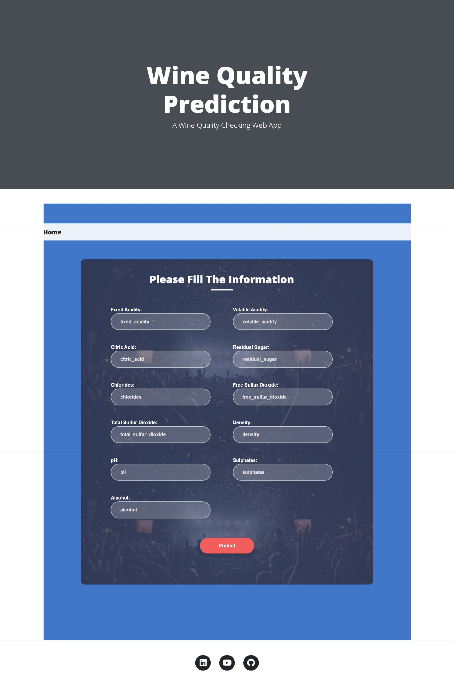
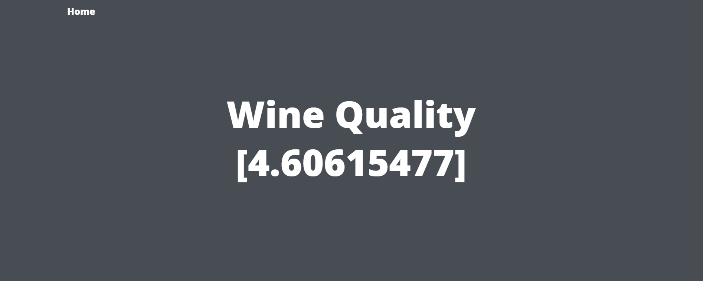

<div align="center">
  <h1>🍷 Wine Quality Prediction Web App</h1>
  <p>An end-to-end Machine Learning web application to predict wine quality based on physicochemical tests.</p>
</div>

---

## 🌟 Overview

This project is a complete Machine Learning pipeline for predicting the quality of wine. It takes in various chemical properties of the wine (like acidity, residual sugar, chlorides, alcohol content, etc.) and uses a trained Machine Learning model to evaluate and predict its quality. 

The project features a beautiful frontend web interface built to make predictions effortlessly.

### 📸 Screenshots

#### User Input Form


#### Prediction Result


---

## 🚀 Features

- **End-to-End Pipeline**: Modular code architecture encompassing data ingestion, validation, transformation, model training, and evaluation.
- **Web Interface**: A clean and responsive web application (HTML/CSS/Flask) for users to input wine features and receive instant predictions.
- **Local Execution**: Completely self-contained and runs locally on your machine without relying on external cloud MLOps platforms (MLflow/DagsHub dependencies have been removed for simplicity).

---

## 🛠️ Project Development Workflow

The project was developed using a systematic modular approach:

1. Update `config.yaml`
2. Update `schema.yaml`
3. Update `params.yaml`
4. Update the entity
5. Update the configuration manager in `src/config`
6. Update the components
7. Update the pipeline 
8. Update `main.py`
9. Update `app.py`

---

## 💻 How to Run Locally

### Step 1: Clone the Repository

```bash
git clone https://github.com/HarshLambe/End-to-end-ML-Project-with-MLflow.git
cd End-to-end-ML-Project-with-MLflow
```

### Step 2: Create a Conda Environment

It is highly recommended to use an isolated environment to avoid dependency conflicts.

```bash
conda create -n mlproj python=3.8 -y
conda activate mlproj
```

### Step 3: Install Requirements

Install all necessary packages, including the local source project:

```bash
pip install -r requirements.txt
```

### Step 4: Run the Application

Start the server to launch the web application:

```bash
python app.py
```

Finally, open up your browser and navigate to the localhost URL (usually `http://127.0.0.1:8080/` or `http://127.0.0.1:5000/`)   `add /train` to train the model and `add /predict` to use the web app!

---
<div align="center">
  <p><i>Developed by Harsh Lambe</i></p>
</div>
